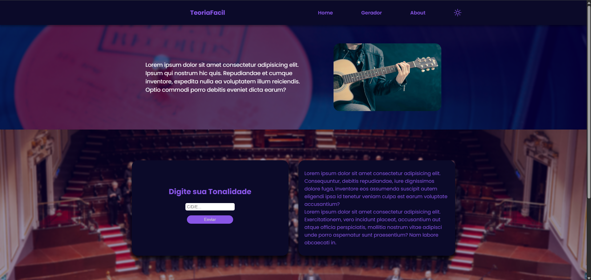
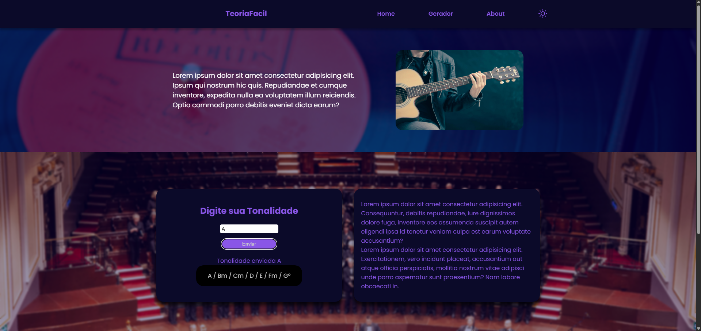

# {Teoria-Facil}

## Preview




Este projeto consiste em uma aplicação para músicos, ele contará com um formulário que passa os devidos acordes conforme a nota que o usuário desejar.

Este repositório contém um projeto desenvolvido utilizando React. Neste arquivo README, você encontrará um guia passo a passo para abrir o projeto em seu ambiente local.

## Pré-requisitos

Antes de começar, verifique se você possui as seguintes ferramentas instaladas em sua máquina:

- Node.js (versão 12 ou superior)
- npm (gerenciador de pacotes do Node.js)

## Passo 1: Clonar o repositório

Comece clonando este repositório para sua máquina local. Abra o terminal e execute o seguinte comando:

```bash
git clone https://github.com/seu-usuario/nome-do-repositorio.git
```

Isso criará uma cópia local do repositório em seu ambiente.

## Passo 2: Instalar dependências

Navegue até o diretório raiz do projeto e execute o seguinte comando para instalar as dependências do Node.js:

```bash
cd front-end
npm install
```

Esse comando irá ler o arquivo `package.json` e instalar todas as dependências necessárias para o projeto.

## Passo 3: Configurar variáveis de ambiente

Por enquanto o projeto não possui nenhuma variavel de ambiente
mas segue exemplo de um .env em que você pode alterar o Host e Port

## Passo 4: Iniciar o servidor

Para iniciar o servidor Node.js, execute o seguinte comando:

```bash
npm start
```

Isso iniciará o servidor e você poderá acessá-lo através do seu navegador no endereço `http://localhost:8080`.
(ou o que você preferir, se quiser alterar é so ir na pasta `.env.example`(agora renomeada para `.env`)e alterar o "PORT" para o de sua preferência. os mais comuns sao 3000 ou 8080).

## Passo 5: Modificar o projeto

Agora que você tem o projeto em execução, você pode fazer modificações no código conforme necessário. Sinta-se à vontade para explorar e adaptar o projeto de acordo com suas necessidades.

## Passo 6: Publicar suas modificações

Se desejar publicar suas modificações em um repositório remoto no GitHub, siga estes passos:

1. Crie um novo repositório vazio no GitHub.
2. No terminal, navegue até o diretório raiz do projeto.
3. Execute os seguintes comandos:

```bash
git remote set-url origin https://github.com/seu-usuario/nome-do-novo-repositorio.git
git add .
git commit -m "Adicionar minhas modificações"
git push -u origin master
```

Isso configurará o repositório remoto e enviará suas modificações para lá.

---
